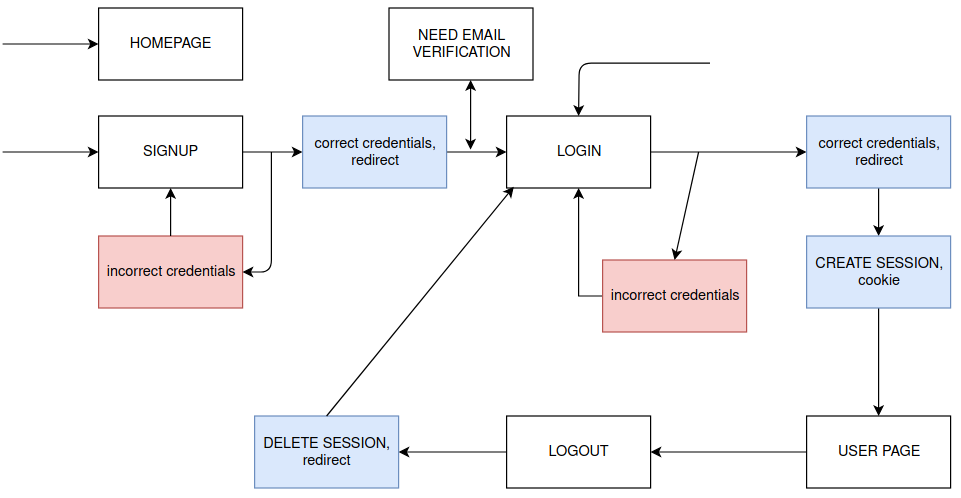

# AUTH SKELETON 
Auth Skeleton it's a basic authentication system based on sessions stored in cookies. It uses the [`google/uuid`](https://github.com/google/uuid) and the standard library [`net/http`](https://godoc.org/net/http). It's builded above the MVC architecture with Mongo as database, and implements TLS as transport layer (thanks to [`gtank/cryptopasta`](https://github.com/gtank/cryptopasta) and his [talk](https://www.youtube.com/watch?v=2r_KMzXB74w) about cryptography). It stores the password with [`crypto/bcrypt`](https://godoc.org/golang.org/x/crypto/bcrypt) for safe password storage. 

## Routes
By default there are this links avaible in the package: 

| Name        | Link   | Purpose                                                     |
|-------------|--------|-------------------------------------------------------------|
| Homepage    | /      | Home of the website, this handler also checks for 404 errors|
| Signup      | /signup| Check credentials and register users                                    |
| Login       | /login | Check credentials of users and create sessions if are correct   |
| Logout      | /logout| Delete session from the database and cookie                 |
| User Webpage| /u/    | Initial website of user, user page after login              |


## How it works 
The database design is avaible in `pkg/model/login.go`: 
```MongoDB
User {
    Username     string 
    Email        string 
    Password     string 
    IsActive     bool 
    EmailChecked bool 
}

UserSession {
    Uuid        string 
    Username    string  
    LoginTime   time.Time 
    LastSeen    time.Time 
}
```

The keys `IsActive` and `EmailChecked` from User db will be required in futures implementations. The first are for user deletions, and the second for email validation after signup (can't login if it isn't confirmed). All the password are stored with [`crypto/bcrypt`](https://godoc.org/golang.org/x/crypto/bcrypt) for prevent password leakage. 

In the `UserSession` we can see the unique value `uuid` and the `username`. This data will be checked by the function `CheckCookie` placed in `pkg/controller/login.go`. The last two values are for time purposes, a timer will clean the database from expired sessions, you can see an example in `cmd/example.go`.  

 Comming up next we can see a diagram related to the steps that an user can follow: 


## Testing 
You can run the testing functions inside `pkg/controller` with 
```
$ go test -v login_test.go 
```
## Usage example 
In `cmd/example.go` you can find the code above: 
```golang 
// Handler with authentication
func ProjectHandler(w http.ResponseWriter, req *http.Request) {
	if username, ok := lc.CheckCookie(w, req); ok {
		//
		// PUT SOME CODE OR QUERY
		//
		fmt.Fprintf(w, "Welcome %v", username)
	} else {
		http.Redirect(w, req, "/login", http.StatusSeeOther)
		return
	}
}

// Handler without authentication
func HelpHandler(w http.ResponseWriter, req *http.Request) {
	fmt.Fprintf(w, "Welcome unknown user")
}
```

Can interact with the authentication status with the function `CheckCookie`, the first statement will check if the cookie is present and verify the uuid credentials. If the uuid is correct, it will return the username and a bool value. If something goes will redirect to login page. 

In the second statement we can see a raw handler without any type of authentication, and only shows a welcome message. 

## TLS 
For the TLS layer we use the code provided by [`gtank`](https://github.com/gtank), you need a certification and key for the server in order to get the code working. For that purpose we can run the following commands: 
```sh 
# For key.pem 
$ openssl genrsa -out key.pem 2048
$ openssl ecparam -genkey -name secp384r1 -out key.pem
# For cert.pem 
$ openssl req -new -x509 -sha256 -key key.pem -out cert.pem -days 3650
```
And place the files inside `cmd/`. After you run it and check the website, it will warning about the self signed certificates. If you want to avoid it, you need a 3rd party certificate like [letsencrypt](https://letsencrypt.org). 

In the other hand, if you just want to play around you can check the code inside [http branch](https://github.com/yfernandezgou/auth-skeleton/tree/http) it's the same but without TLS layer.

## Customization 
This implementation is just a proof of concept, but feel free to change any data inside `pkg/view/templates` for html pages customization. 
